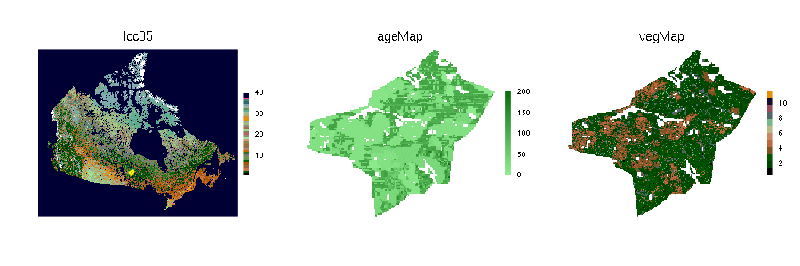
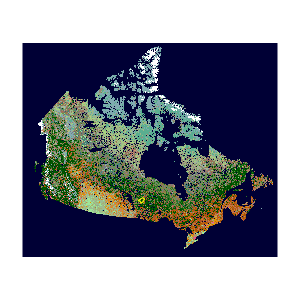

<head>
    <meta charset="utf-8">
    <meta http-equiv="X-UA-Compatible" content="chrome=1">
    <link rel="stylesheet" href="stylesheets/styles.css">
    <link rel="stylesheet" href="stylesheets/pygment_trac.css">
    <meta name="viewport" content="width=device-width, initial-scale=1, user-scalable=no">
</head>

# Spatial Discrete Event Simulation (SpaDES)

### Develop and run spatially explicit discrete event simulation models

 

Easily implement a variety of simulation models, with a focus on spatially explicit models. These include raster-based, event-based, and agent-based models.
The core simulation components are built upon a discrete event simulation framework that facilitates modularity, and easily enables the user to include additional functionality by running user-built simulation modules. 
Included are numerous tools to rapidly visualize raster and other maps.
(showing above, a simple example with a mixture of an agent-based model and raster-based process models of vegetation change and fire.)

[**Getting Started**](https://github.com/PredictiveEcology/SpaDES/wiki/Getting-Started-Guide) [https://github.com/PredictiveEcology/SpaDES/wiki/Getting-Started-Guide](https://github.com/PredictiveEcology/SpaDES/wiki/Getting-Started-Guide) 


[**Vignettes**](https://github.com/PredictiveEcology/SpaDES/wiki/Help-Vignettes) [https://github.com/PredictiveEcology/SpaDES/wiki/Help-Vignettes](https://github.com/PredictiveEcology/SpaDES/wiki/Help-Vignettes) 

**`SpaDES` User Group:** [https://groups.google.com/forum/#!forum/spades-users](https://groups.google.com/forum/#!forum/spades-users)

**Blog:** [http://PredictiveEcology.org](http://PredictiveEcology.org)

**Website:** [http://SpaDES.PredictiveEcology.org](http://SpaDES.PredictiveEcology.org)

**Wiki:** [https://github.com/PredictiveEcology/SpaDES/wiki](https://github.com/PredictiveEcology/SpaDES/wiki)

**Proof of concept:** [https://spades.shinyapps.io/ForestChange_ProofOfConcept](https://spades.shinyapps.io/ForestChange_ProofOfConcept)

**GitHub Repository:** [https://github.com/PredictiveEcology/SpaDES](https://github.com/PredictiveEcology/SpaDES)

**Canadian Forest Service:** [Part of CFS adaptation toolkit](http://www.nrcan.gc.ca/forests/climate-change/tools-resources/17770)

**Example Model for R-savvy users** [LandCoverChange](https://raw.githubusercontent.com/PredictiveEcology/SpaDES-modules/master/modules/LCC2005/LCC2005.Rmd). Copy the linked `.Rmd` file to your computer. Open it with a text editor (such as Rstudio), run all chunks in R. It is not intended to be knitted; knitting will only output the script. 

## Workshops

We will be giving workshops about SpaDES. See [here for intro workshops in the fall of 2016](http://predictiveecology.org/2016/08/09/SpaDES-workshops.html). We will be adding more over time.

## Installation

Building packages from source requires the appropriate development libraries for your operating system (*e.g.*, Windows users should install [Rtools](http://cran.r-project.org/bin/windows/Rtools/)).

The suggested package `fastshp` can be installed with:

```r
install.packages("fastshp", repos="http://rforge.net", type="source")
```


### Current stable release [](https://travis-ci.org/PredictiveEcology/SpaDES) [](https://coveralls.io/r/PredictiveEcology/SpaDES?branch=master) [](https://cran.r-project.org/package=SpaDES) [](https://cran.rstudio.com/package=SpaDES)

**Install from CRAN:**

```r
install.packages("SpaDES")
```

**Install from GitHub:**
    
```r
#install.packages("devtools")
library("devtools")
install_github("PredictiveEcology/SpaDES") # stable
```

### Development version (unstable) [](https://travis-ci.org/PredictiveEcology/SpaDES) [](https://coveralls.io/r/PredictiveEcology/SpaDES?branch=development)

**Install from GitHub:**

```r
#install.packages("devtools")
library("devtools")
install_github("PredictiveEcology/SpaDES", ref="development") # unstable
```


## Reporting bugs

Contact us via the package GitHub site: [https://github.com/PredictiveEcology/SpaDES/issues](https://github.com/PredictiveEcology/SpaDES/issues).

This project is maintained by Eliot McIntire (eliot.mcintire at canada.ca) and Alex Chubaty (alexander.chubaty at canada.ca)

<small>Hosted on GitHub Pages</small>
